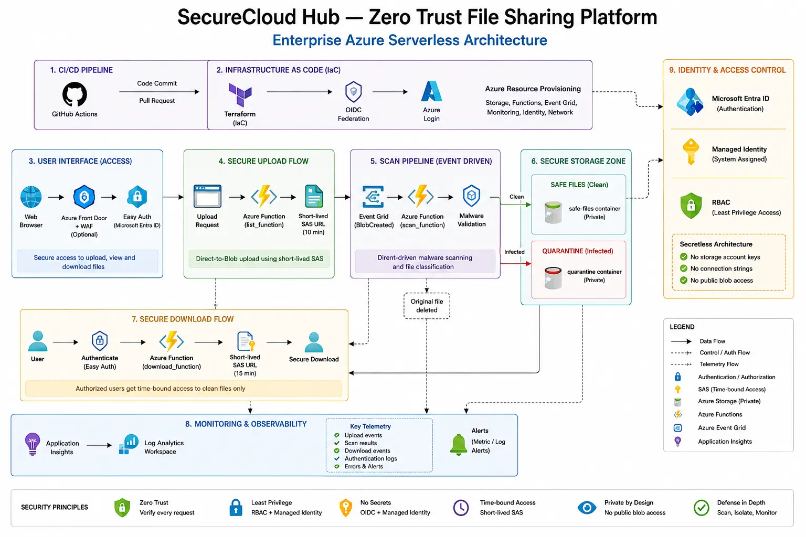

# SecureCloud Hub-Zero-Trust Azure Secure File Sharing Platform

SecureCloud Hub is a production-style Azure cloud security project that demonstrates how to build a zero-trust file sharing platform using Microsoft Entra ID, Azure Functions on Flex Consumption, private Blob Storage, Event Grid, managed identity, Terraform, and GitHub Actions with OIDC.

It is designed to showcase practical Azure engineering skills for cloud, infrastructure, DevOps, and security-focused roles.

---

## Architecture Overview

### Enterprise Architecture



---

## Project Summary

SecureCloud Hub demonstrates how to build a secure Azure-native file processing workflow using identity-first access controls, event-driven automation, Infrastructure as Code, and centralized observability.

The platform authenticates users with Microsoft Entra ID, securely uploads files using short-lived SAS tokens, scans uploads through an automated malware processing pipeline, isolates infected content, and only allows secure downloads for validated clean files.

The solution was designed to mirror enterprise cloud engineering and security patterns commonly used in regulated and zero-trust environments.

---

## Key Objectives

- Enforce identity-first secure file access
- Prevent anonymous Blob Storage exposure
- Process uploads through an event-driven malware pipeline
- Isolate trusted and untrusted files
- Generate short-lived secure download access
- Centralize monitoring and audit visibility
- Deploy infrastructure using Terraform and CI/CD

---

## Technologies Used

- Azure Functions (Python)
- Azure Blob Storage
- Azure Event Grid
- Microsoft Entra ID
- App Service Easy Auth
- Managed Identity + RBAC
- Terraform
- GitHub Actions
- OpenID Connect (OIDC)
- Application Insights
- Log Analytics Workspace
- KQL

---

## Core Features

### Secure Authentication

Microsoft Entra ID and Easy Auth enforce authenticated access to the platform before uploads or downloads can occur.

### Direct-to-Blob Secure Uploads

Authenticated users receive short-lived write SAS tokens allowing secure uploads directly into private Blob Storage containers.

### Event-Driven Malware Processing

BlobCreated events trigger the malware scanning workflow automatically using Azure Event Grid and Python Azure Functions.

### Clean and Quarantine Separation

Clean files are moved into the `safe-files` container while infected files are isolated into the `quarantine` container.

### Secure Download Workflow

The `download_function` validates:

- authenticated identity
- blob ownership
- clean scan metadata

before issuing a short-lived read-only SAS URL.

### Monitoring and Audit Visibility

Application Insights, Log Analytics, Function logs, and Storage diagnostics provide centralized observability across the environment.

---

## Architecture Layers

- GitHub Actions OIDC Deployment Layer
- Terraform Infrastructure Layer
- Microsoft Entra ID Authentication Layer
- Azure Functions Processing Layer
- Blob Storage Security Layer
- Event Grid Automation Layer
- Malware Scanning Workflow
- Monitoring and Observability Layer

---

## Deployment Evidence

Deployment screenshots and architecture assets are stored in:

```text
docs/screenshots/
docs/architecture/
```

These include:

- Event Grid trigger validation
- Malware scan execution
- Storage container separation
- Application Insights traces
- KQL investigation queries
- GitHub Actions deployments
- Terraform infrastructure deployment
- Secure download validation

---

## Live Project Walkthrough

Architecture Overview:
[SecureCloud Hub Portfolio Page](https://oowusu.com/secure-cloud-hub.html?utm_source=chatgpt.com)

Technical Deep Dive:
[SecureCloud Hub Engineering Deep Dive](https://oowusu.com/secure-cloud-hub-engineering-deepdive.html?utm_source=chatgpt.com)

---

## Deployment Approach

Infrastructure was deployed using Terraform and GitHub Actions with OpenID Connect federation to enable secure, repeatable, passwordless Azure deployments without long-lived client secrets.

---

## Learning Outcomes

- Zero-trust Azure architecture
- Event-driven cloud workflows
- Secure SAS delegation patterns
- Azure Functions with Python
- Terraform Infrastructure as Code
- OIDC-based CI/CD pipelines
- Managed Identity and RBAC
- Azure monitoring and KQL investigation
- Secure storage and malware isolation workflows

---

## License

MIT License
